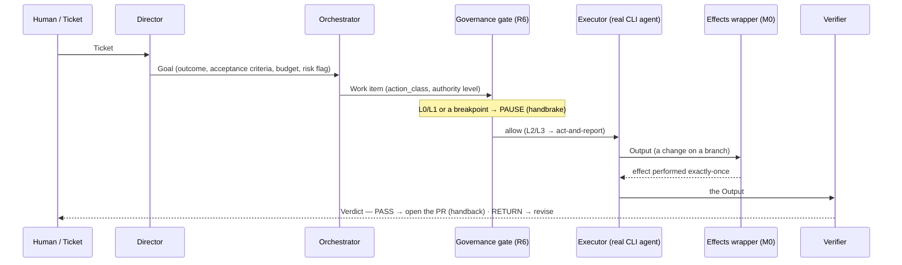

# Anatomy of a Run

How one **ticket** becomes a **verified pull request** — the inputs, the flow, and what each role
does, step by step. This is the operational companion to [`Role-Contracts.md`](Role-Contracts.md)
(the contracts) and [`Using-a-Cell.md`](Using-a-Cell.md) (how to drive it). Everything below is
real: every step is a durable, hash-chained event you can read back with `python -m cell.observe`.

---

## 1. The input — a `Ticket`

A run starts when you hand the cell one ticket (`cell.submit(ticket, flow_id)`). That's the whole
input surface.

| Field | Meaning | Example |
|---|---|---|
| `id` | your identifier for the request | `"t-roman"` |
| `source` | where it came from | `"tracker"` / `"cli"` |
| `title` | one-line summary (becomes the goal's outcome) | `"Implement to_roman(n)"` |
| `body` | the full request — the task | `"Implement to_roman(n) in roman.py so test_roman.py passes."` |
| `received_at` | when it arrived | a timestamp |
| `raw_refs` | optional pointers (links, attachments) | `[]` |

For the **live slice** (`python -m cell.live`), the env var `CELL_TASK` becomes the ticket body and
the target checkout is where the work happens (see the [runtime runbook](../src/cell/runtime/README.md)).

---

## 2. The flow at a glance



Every arrow is a **durable handoff through the event plane**, not a blocking call — a flow waiting
on a human is a paused, checkpointed flow, costing nothing while it waits.

---

## 3. Step by step (the table)

This is exactly what `cell.observe` shows for a finished run — here, generalized.

| # | Step | Role | What it does | Governed by | Produces (event) |
|---|---|---|---|---|---|
| 0 | **specify** | Director | turns the ticket into a **Goal** — outcome, explicit acceptance criteria, a budget cap, and a risk flag for anything touching a higher authority class | Art. 2 (purpose), Art. 4 (risk) | `decision · specify` |
| 1 | **decompose** | Orchestrator | sequences the Goal into **work items**, each with its `action_class`, authority level, and declared breakpoints; assigns an Executor | Art. 5.2 (breakpoints) | `decision · decompose` |
| — | *route* (optional) | Optimizer | when ≥2 implementer versions exist, picks the **cheapest active version that clears the task's capability floor** (by attributed cost) | Art. 11 floor, §10 | `decision · route` |
| 2 | **govern** | Governance plane | evaluates the work item's action against the compiled rules **before** any effect: `allow` (L3/L2 act-and-report) or **pause** (L1/L0 → the handbrake) or `block` | R1–R12 (Art. 4, 5, 6) | `governance · allow/block` |
| 3 | **execute** | Executor (a real `claude -p`, here) | makes the change on a working branch — edits files, commits — and reports an **Output** (`artifact_ref` = branch) plus its cost | Art. 4 (own-artifacts, L2) | `action · execute` (+ cost) |
| 4 | **perform** | Effects wrapper | runs the work-item's external effect through the **idempotency wrapper** — exactly-once for reversible, at-most-once for irreversible, even across a crash/resume | invariant #4, Build-Spec §4 | `action · perform` |
| 5 | **verify** | Verifier (a real `pytest`, here) | scores the Output against the acceptance criteria — **PASS** or **RETURN** (with the failure reason); must be **independent of the producer** | R5 (Art. 5.1) | `verdict` |
| 6 | **deliver** | Effects wrapper | on a PASS, **opens the PR** (the handback) through the wrapper — irreversible, exactly-once. The cell **never merges** | Art. 2.2, R6 | `action · perform → PR url` |

A **RETURN** verdict loops back to step 3 (produce → score → revise) up to `max_revisions`, then
escalates. A **block** or an L1/L0 pause hands control to a human through the handbrake.

---

## 4. The cast

**Operating roles** (do the work):
- **Director** — owns *what & why*: scope, acceptance criteria, risk flags. Does not do the work.
- **Orchestrator** — owns *who does what, when*: decomposition, sequencing, breakpoints, retry/escalate.
- **Executor** — owns *how*: produces the change for one work item, within its authority class. Replaceable behind the contract — a reference stub or a real CLI agent (`claude -p`).
- **Verifier** — owns the **gate**: independent pass/return on the Output before handback.

**System roles** (keep the machine healthy — non-authoritative, no business decisions):
- **Steward** — reliability: watches for drift / loops / cost-spiral and quarantines + rolls back a misbehaving flow.
- **Optimizer** — efficiency: routes each work item to the cheapest *capable, active* version (only where there's spread to route).
- **Auditor** — version fitness & safety: rates each version over time, flags regressions, and suspends a *dangerous* one (a safety breach) with a human SLA. Reports via `cell.audit()`; acts via `cell.enforce()`.

**Always present, around every step:**
- **The Governance plane** — the compiled rules (R1–R12), evaluated per action before the effect; every allow/block cites a constitution clause.
- **The Handbrake** — pause · inspect · inject · resume · replay, callable on **any** flow at any time (invariant #3). Re-running a `flow_id` *resumes*, never restarts.
- **The event plane** — every step is appended, hash-chained, and tamper-evident; state lives here, never in an agent's memory (invariant #5).

---

## 5. What comes out

- A **Verdict** (`pass` / `return` / `block`) or a **Paused** handle, returned from `submit`.
- On pass, a **real PR** handed back to the existing human review/merge process — opened exactly-once.
- A complete, durable **trail**: every decision, the governance allow/block, the execute + its cost,
  the verdict, and the performed effects — replayable and auditable forever.

---

## 6. See it yourself — a real run

A live run on a fresh ticket ("implement `to_roman(n)`"), read back with
`python -m cell.observe <state_db> live-1`:

```
flow: live-1     db: cell-sandbox-roman.cell-state.db
actors: Director(ref-v0) · Orchestrator(ref-v0) · Executor(real-cli) · Verifier(real-pytest)
events: 7        window: 06:52:42 → 06:53:40 (58s)        chain: ✓ intact

  seq  kind         actor          key fact
    0  decision     Director       specify · goal goal-live-1 (in_purpose)
    1  decision     Orchestrator   decompose · 1 work item
    2  governance   Executor       ALLOW L2 CLASS_OWN_WRITE
    3  action       Executor       execute → branch:cell/slice@d8c1100…
    4  action       Executor       perform CLASS_OWN_WRITE [compensable] → branch:cell/slice@d8c1100…
    5  verdict      Verifier       PASS
    6  action       Executor       perform CLASS_VISIBLE_OUTPUT [irreversible] → https://github.com/…/pull/1

VERDICT: PASS
execute attempts: 1   ·   re-derivations: 1 (specify→decompose→govern)
governance: 1 allow · 0 block
effects: irreversible CLASS_VISIBLE_OUTPUT → https://github.com/…/pull/1  (exactly-once ✓)
total cost: 1625 tokens, 53301ms wall
chain: ✓ intact (tamper-evident)
```

The agent took ~53s and **1625 tokens** to implement `to_roman`; the Verifier ran the real tests and
returned PASS; both effects (the branch write and the PR) were performed exactly-once; the chain is
intact. After the run, the **Auditor** rates that executor version from this field activity:

```python
cell.audit()            # {'real-cli': VersionRating(verdict='unproven', runs=1, pass_rate=1.0, mean_cost=1625)}
```

— `unproven` because one run is not yet enough to judge a version's fitness. That is the whole cell,
end to end: a ticket in, a verified PR out, every role accountable on a durable trail.
